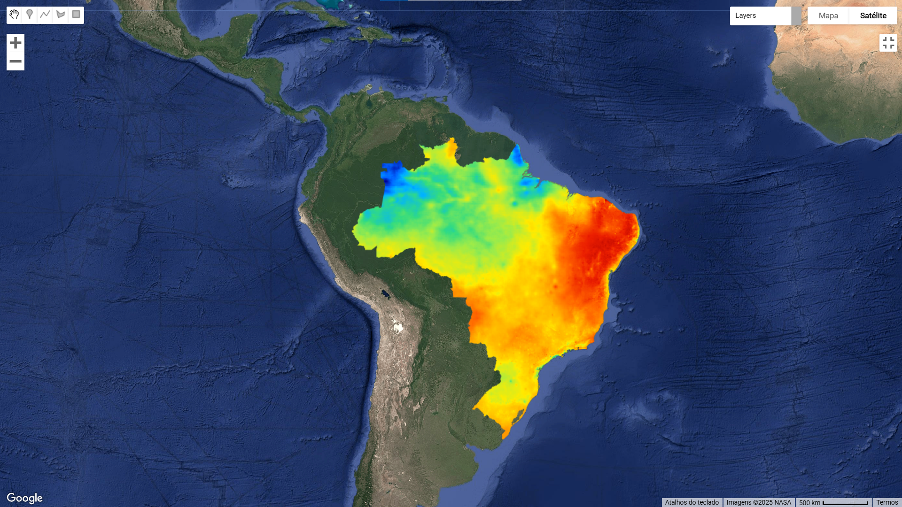
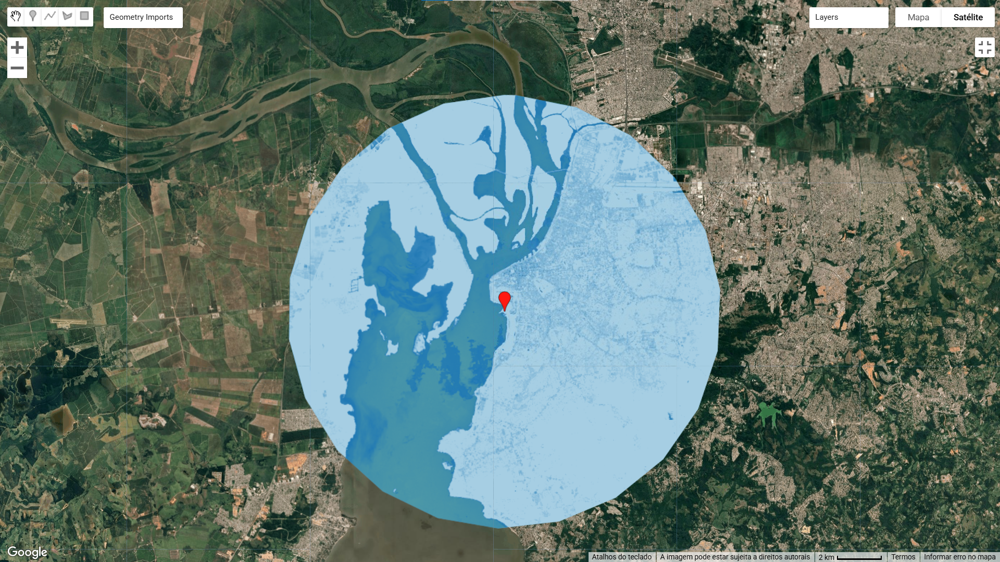
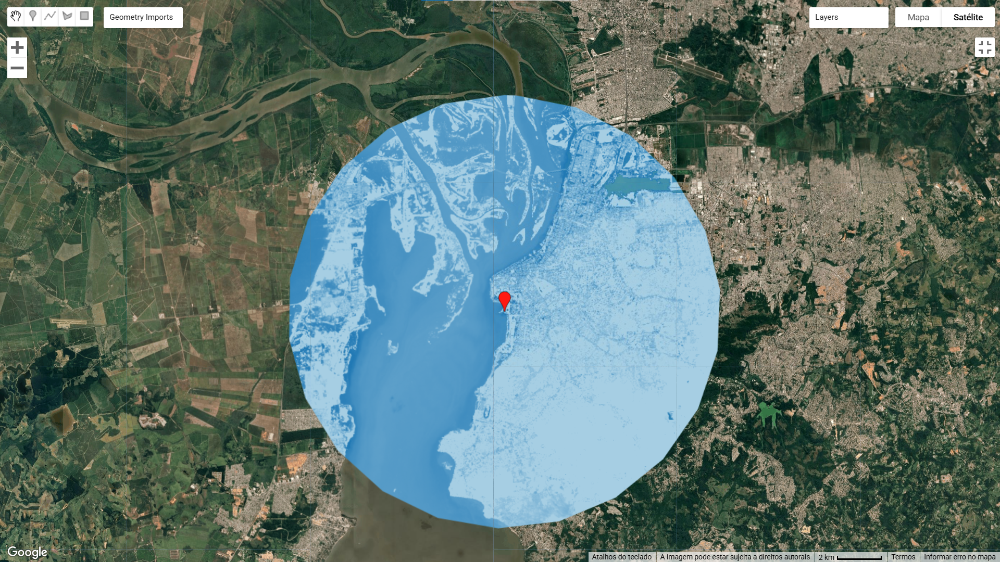
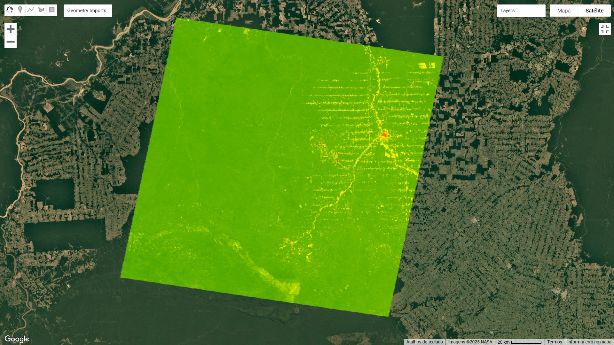
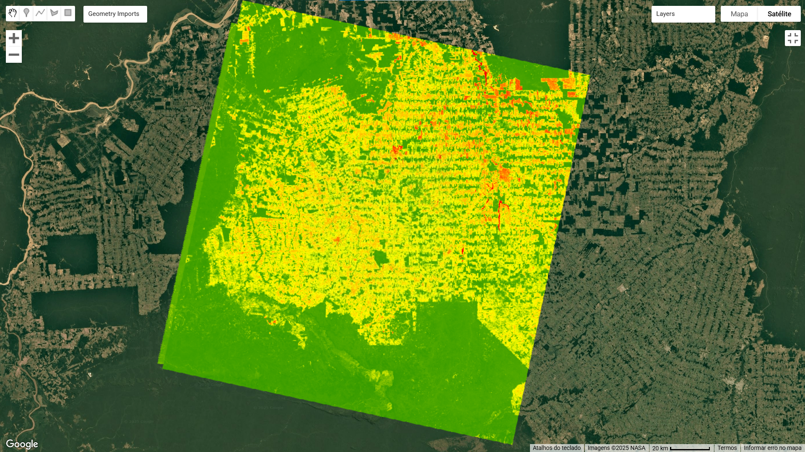

# 💻🌍 GEE – Análises com Google Earth Engine

Este repositório reúne **scripts JavaScript** desenvolvidos na plataforma **Google Earth Engine (GEE)**, com foco em análises hidroambientais como **chuvas, NDVI e imagens Landsat**, aplicadas a regiões da Paraíba, Rio Grande do Sul, Rondônia e Ceará.

---

## 🎯 Objetivo

Executar análises espaciais na nuvem com GEE para estudar a dinâmica da vegetação e precipitação ao longo dos anos, utilizando índices espectrais e séries históricas, com aplicação na Engenharia Civil e Gestão de Recursos Hídricos.

---

## 🧾 Scripts disponíveis

📁 Diretório raiz contém os seguintes arquivos:

| Arquivo | Descrição |
|--------|-----------|
| `chuva_anual_pb_2023.js` | Precipitação anual da Paraíba em 2023 |
| `chuva_media_anual(1981_2023).js` | Média de chuvas entre 1981 e 2023 do Brasil |
| `chuva_fontura.js` | Análise de chuvas no Desastre do Rio Grande do Sul|
| `landsat_ce.js` | Análise com imagens Landsat no Ceará |
| `ndvi_arquimedes.js` | NDVI para comparação de uso do solo em Arquimedes - RO |

---

| Precipitação anual da Paraíba em 2023 |

🌧️ Precipitação Média no Brasil – ( 1981 - 2023 )

🗺️ Descrição do Mapa

A visualização foi construída sobre uma imagem de satélite (Google / NASA) com sobreposição de um raster climático representando a distribuição espacial da precipitação média.

Área mapeada: Brasil (escala nacional)

Fonte de dados: Estimativas derivadas de satélites de precipitação (CHIRPS)

Resolução espacial: Aproximadamente 5 a 10 km por pixel

Projeção: Web Mercator

🎨 Escala de Cores

Azul: Regiões com precipitação elevada (ex.: Amazônia ocidental)

Verde e Amarelo: Precipitação intermediária

Laranja e Vermelho: Regiões com menor precipitação acumulada no período (ex.: Nordeste e parte do Sudeste)

📊 Padrões Observados

O mapa evidencia contrastes marcantes entre as regiões brasileiras:

Amazônia: Alta pluviosidade devido à convecção intensa e proximidade com a Zona de Convergência Intertropical (ZCIT).

Centro-Oeste e Sudeste: Precipitação intermediária, influenciada por sistemas frontais e pela Zona de Convergência do Atlântico Sul (ZCAS).

Nordeste: Menores índices de precipitação, especialmente no interior, devido à influência do clima semiárido e da continentalidade.

🌍 Aplicações

Estudos de variabilidade e mudanças climáticas

Planejamento de recursos hídricos

Monitoramento agroclimático

Análise de risco para estiagens e enchentes

|  Análise de chuvas no Desastre do Rio Grande do Sul | 

|  Análise do NDWI no Desastre do Rio Grande do Sul | 

| NDVI para comparação de uso do solo em Arquimedes - RO | 

## 🚀 Como usar os scripts

### 🛰️ Via GEE Code Editor (JavaScript)
1. Acesse: [code.earthengine.google.com](https://code.earthengine.google.com)
2. Copie e cole o conteúdo do script `.js`
3. Execute o código e visualize os resultados no mapa

---

## 🔧 Tecnologias e Ferramentas

- Google Earth Engine – JavaScript API
- Imagens Landsat e CHIRPS (precipitação)
- Git & GitHub para versionamento
- (Opcional) Python API do GEE + QGIS

---

## 👨🏾‍💻 Autor

**Daniel Conceição do Nascimento**  
Graduando em Engenharia Civil – UFPB  
💼 Foco em Geotecnologias aplicadas à Hidrologia e Recursos Hídricos

🔗 [Portfólio no SpatialNode](https://www.spatialnode.net/danel_nasc)  
🔗 [GitHub](https://github.com/Daniel-Nascimentoeng)

---

